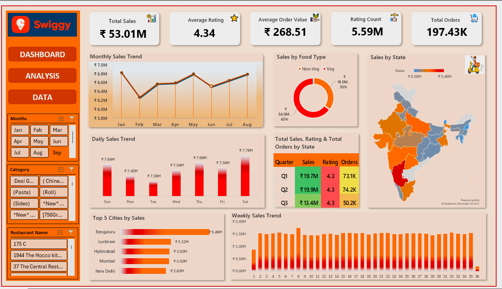

# Swiggy Sales Analysis Dashboard (Excel)

## Project Overview

This project presents an interactive Excel dashboard built using Swiggy 2022 sales data. The dashboard provides business insights through data visualization, KPI tracking, trend analysis, and regional performance evaluation.

---

## Business Objective

To analyze Swiggy sales performance across different states, cities, categories, and time periods to identify trends, customer behavior, and growth opportunities.

---

## Tools Used

- Microsoft Excel
- Pivot Tables
- Pivot Charts
- Slicers
- Conditional Formatting
- Map Visualization
- Data Cleaning Techniques

---

## Key Performance Indicators (KPIs)

| KPI | Value |
|------|------|
| Total Sales | ₹53.01M |
| Total Orders | 197.43K |
| Average Rating | 4.34 |
| Average Order Value | ₹268.48 |

---

## Dashboard Preview

### Main Dashboard

---

## Analysis Screens

### Analysis 1

.png)

### Analysis 2

.png)

### Analysis 3

.png)

---

## Key Insights

### Sales Analysis
- Total Sales reached ₹53.01M.
- Bengaluru contributed the highest revenue.
- Non-Veg category generated higher sales compared to Veg category.

### Customer Analysis
- Average customer rating remained above 4.3.
- Order volume remained consistent throughout the year.

### Regional Analysis
- Major metropolitan cities contributed the highest sales.
- Several states showed strong order frequency and customer engagement.

### Trend Analysis
- Monthly and weekly trends reveal seasonal demand patterns.
- Dashboard enables interactive filtering using slicers.

---

## Skills Demonstrated

- Data Cleaning
- Data Visualization
- Dashboard Design
- Business Intelligence
- KPI Development
- Data Analysis
- Excel Reporting

---

## Project Files

- Swiggy Dashboard Workbook
- Raw Dataset
- Dashboard Screenshots
- Analysis Reports

---

## Author

### Vivek Bhatt

Aspiring Data Analyst focused on transforming data into business growth through analytics, visualization, and actionable insights.

GitHub:
https://github.com/vivekbhatt2214

LinkedIn:
https://www.linkedin.com/in/vivek-bhatt-data-analytics
